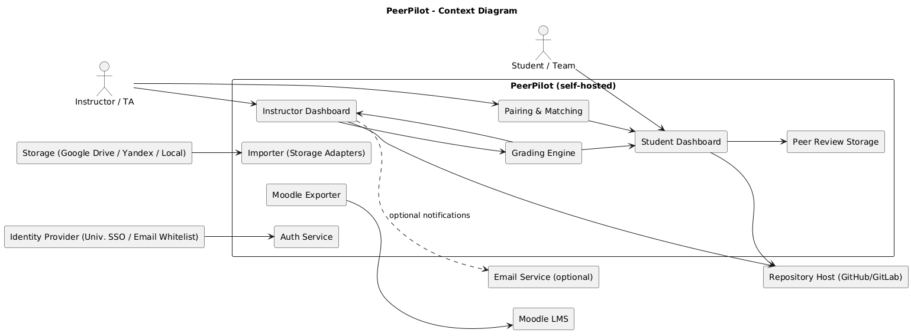
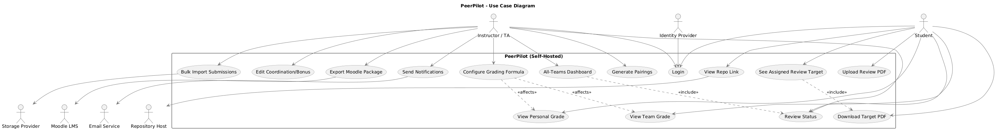
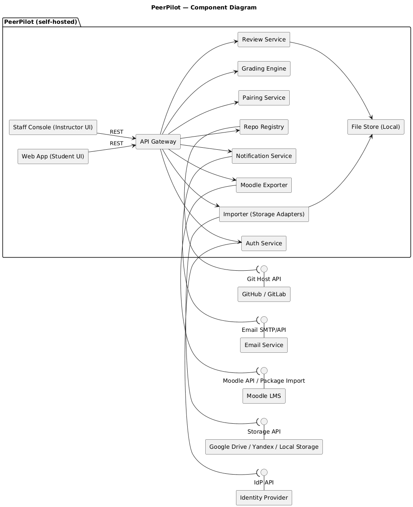
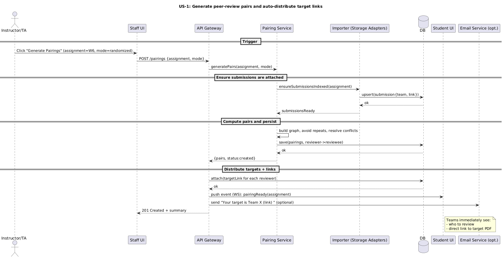
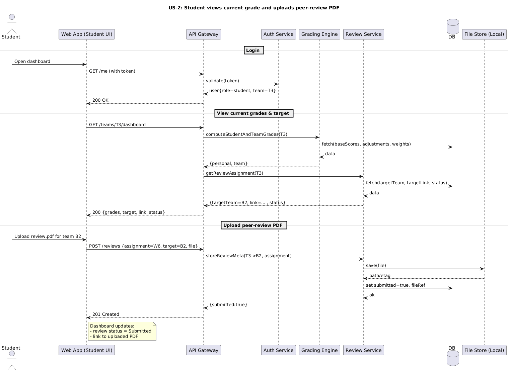

## Table of Contents
- [Interactive Prototype](#interactive-prototype)
- [Context Diagram](#context-diagram)
- [Use Case Diagram](#use-case-diagram)
- [Component Diagram](#component-diagram)
- [Sequence Diagrams](#sequence-diagrams)
## Interactive Prototype
[Open the Figma prototype](https://www.figma.com/proto/hk0bqFHLPL5NcOpYbwDr6x/Untitled?node-id=0-1&t=UeW5SXTSeFen4Ni6-1)
## Context Diagram

| Actor / System | Description | Key Interactions |
|---|---|---|
| Student / Team | Students performing peer reviews and tracking progress. | View personal/team grades; see assigned review targets; download target submission; upload review PDF. |
| Instructor / TA | Course staff managing pairings, grading, and exports. | Generate reviewer–reviewee pairs; import submissions; edit coordination/bonus points with justification; track review status; export to Moodle. |
| Moodle LMS | Official gradebook and final archive. | Receive Moodle-ready exports (grades + feedback bundles) for bulk upload. |
| Storage (Google Drive / Yandex / Local) | Source/location of submission PDFs. | Bulk import of assignment files; auto-attach PDFs to the correct teams; provide review links. |
| Repository Host (GitHub/GitLab) | External code repositories referenced by teams. | Store/display repo links per team in dashboards. |
| Identity Provider (University SSO / email whitelist) | Authentication and authorization source. | Server-side login and role assignment (student vs instructor). |
| Email Service (optional) | Outbound notifications and reminders. | Send course/admin messages if notifications are enabled. |
## Use Case Diagram

| Actor | Description | Main Goals |
|---|---|---|
| **Student / Team** | Students working in teams who perform peer reviews and track progress. | See current personal/team grades; see assigned review target; download target submission; upload review PDF; check review status; open repo link. |
| **Instructor / TA** | Course staff managing pairings, grading, and course operations. | Generate pairings; bulk-import submissions; adjust coordination/bonus points with justification; configure grading formula; monitor review status; export Moodle-ready package; send notifications. |
| **Moodle LMS** *(System)* | Official gradebook/archive used by the university. | Receive exported grades and feedback bundles in compatible format. |
| **Storage Provider** *(System)* | Source/location of submission PDFs (Drive/Yandex/Local). | Serve files for bulk import to attach PDFs to correct teams. |
| **Identity Provider** *(System)* | University SSO or email-whitelist auth. | Authenticate users and provide roles. |
| **Repository Host** *(System)* | GitHub/GitLab with team repos. | Provide repo links displayed in dashboards. |
| **Email Service** *(System)* | Outbound mailer used if notifications are enabled. | Deliver reminders and admin messages. |
### Component Diagram

| Component | Responsibilities |
|---|---|
| **Web App (Student UI)** | Student-facing SPA: shows personal/team grades, assigned review targets, links to target PDFs, review upload. |
| **Staff Console (Instructor UI)** | Spreadsheet-like console: all teams view, pairing trigger, coordination/bonus edits with justification, status monitoring, exports. |
| **API Gateway** | Single REST entrypoint, authn/z enforcement, request validation, routing to domain services, response shaping, rate limiting. |
| **Auth Service** | Login, session management, role resolution; integrates with **IdP API** (SSO or email whitelist) for authentication. |
| **Pairing Service** | Generates reviewer↔reviewee mappings (cyclic/randomized), prevents repeats/collisions, persists schedule per assignment. |
| **Grading Engine** | Central grade formula evaluation; combines base scores with coordination/bonus adjustments; computes per-student and team grades on demand. |
| **Review Service** | Manages review assignments and submissions; accepts team→team review PDFs; tracks incoming/outgoing review status; stores files to **Local File Store**. |
| **Importer (Storage Adapters)** | Bulk imports submissions from **Storage API** (Drive/Yandex/Local); maps files to teams/assignments; normalizes filenames/folders. |
| **Moodle Exporter** | Produces Moodle-ready bundles: grades CSV and feedback ZIP with correct directory structure so Moodle can match “A reviewed B”. |
| **Repo Registry** | Stores/display team repository links; optional metadata fetch from **Git Host API**. |
| **Notification Service** | Optional outbound emails (missing review, export ready, etc.) via **Email SMTP/API**; templating and rate limiting. |
| **File Store (Local)** | Local persistent storage for imported submissions and uploaded review PDFs (self-hosted, privacy-preserving). |
### Sequence Diagrams

